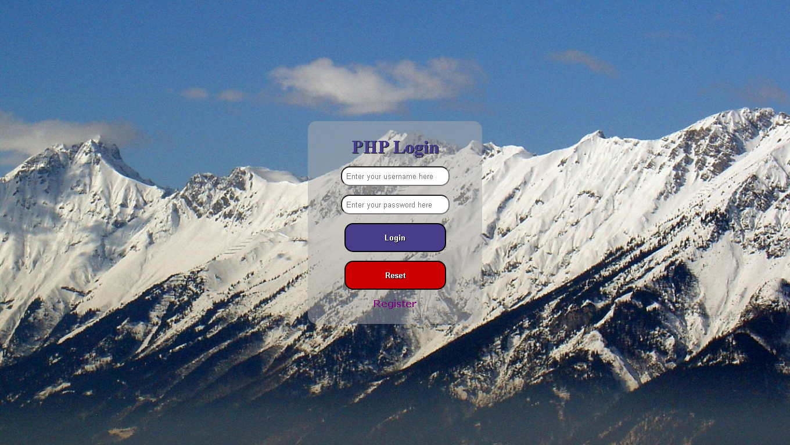
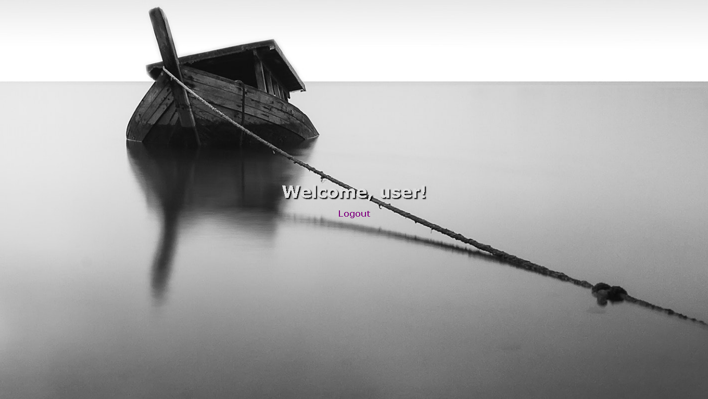

# PHP_Login

In this project, I've created a login menu with PHP.

### Images of The Project Next

### login.php (login page):

### register.php (register page):

### home.php (home page):

<strong>P. S.: This project isn't done yet. - That's due to the fact that I can't install MySQL in my machine.</strong>
